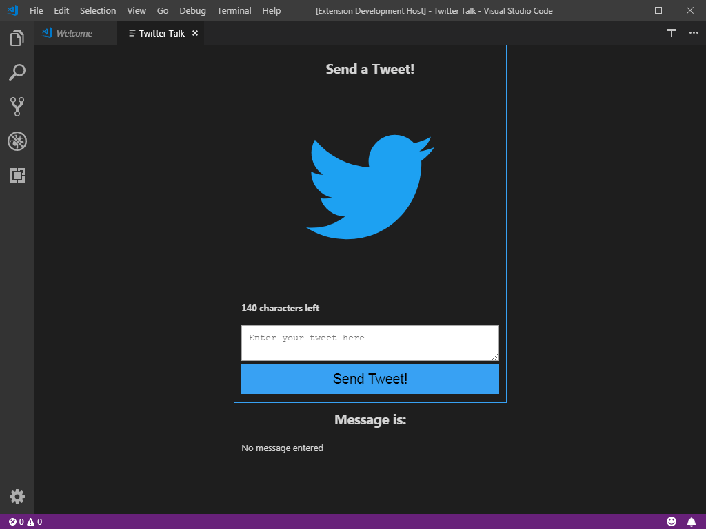
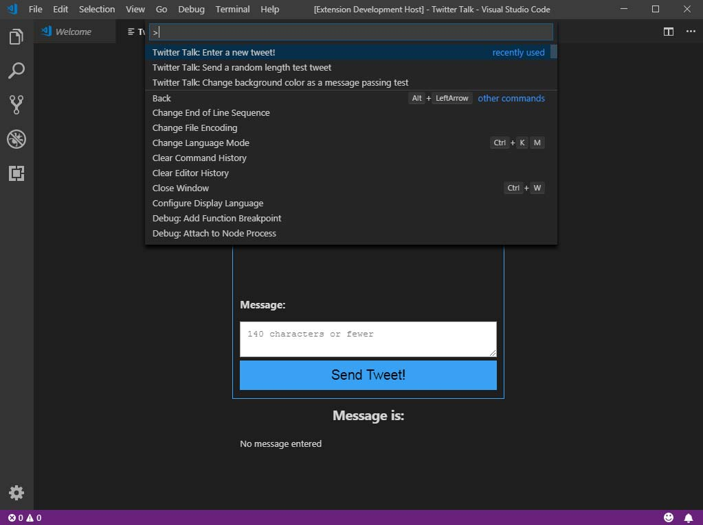

# twitter-talk README

Extension "twitter-talk" for Visual Studio Code written in Typescript utilizing Node.js on the backend with HTML/CSS/Javascript on the front-end loading in a Webview. This extension utilizes saved credentials in an external .json config file to send out test tweets to the twitter profile associated with the credentials through Twitter's API.

## Features

There are three commands:

### Twitter Talk: Enter a new tweet!

Starts the application and a webview allowing the user to enter a new message and tweet it

### Twitter Talk: Send a random length test tweet

If the Webview is already visible (and thus the extension is running) sends a random tweet of 3-7 words from an internal array of words. This allows testing tweet functionality without running into Twitter's restriction on duplicate tweets.

### Twitter Talk: Change background color as a message passing test

With the Webview visible, will toggle the background color of the box to blue and back to transparent.

## Requirements

src/config.json is required to connect to a twitter account. The requirements for config.json is described in config.ts and are the standard keys offered by the Twitter API. When you have created the file, put it in the src folder.

## Known Issues

"Twitter Talk: Send a random length test tweet" command does not function unless "Twitter Talk: Enter a new tweet!" has been called, initializing the extension.

## Release Notes

### 1.0.0

Initial release of the extension.

### 1.0.1

Restructured files to use external style.css and scripts.js for client side formatting and scripting

### 1.0.2

Added a counter to check the length of the entered message and display the current count to the user
